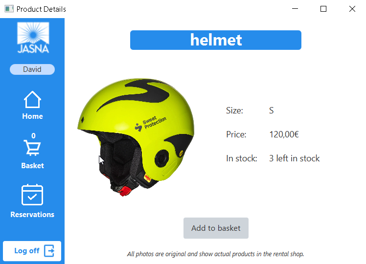

# Intent
The project was created to automate the process of renting ski equipment. There are many rentals that allow customers to book services or equipment that they offer online, but members of our group have not met with a winter sports equipment rental that allows the customer to rent skis through the online system. 

# Process
Software was created using Java and along with using several libraries. GUI was made with help of JavaFx library.  This allows easier creating and modifying of GUI. For manipulating with database using Java and accessing data from database through PostgreSQL was used JDBC, Java database connectivity. 
Thanks to MVVM, software is divided into packages with single-responsibility and splitted into model, view-model and model. This structure was useful for following SOLID.

# End Result
From user point of view, system not only satisfies every requirement, but it also involve several extra features. The system can save images to the database and then display them properly in the application. Also, user can pick exact dates for which the reservation should be placed. From programmer point of view, the system was tested using white-box and black-box approach. System also uses number of design patterns, thanks to what it is simply extendable and easy to manage in future. 

